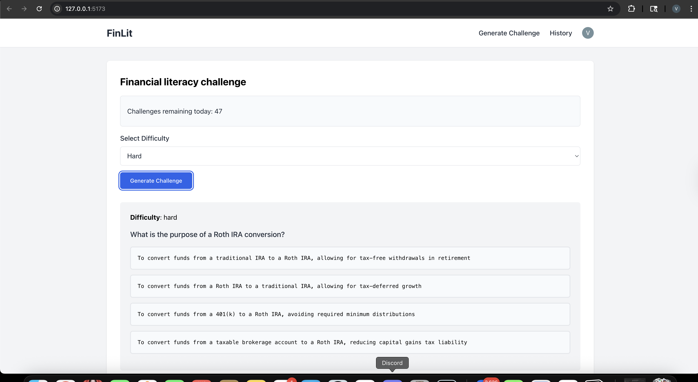

# FinLit

 ''' 
 frontend
    clerk authenticates just in
    issue jwt token
    sent to the backend 

backend 
    connet to clerk
    ask clerk if the token is valid - we are going to do this network less - with the JWT_KEY

 ''' 

 